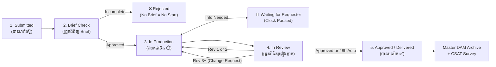

# B'Groceries SLA — Enterprise Ticketing & Turnaround Time (TAT) Governance

> **Internal Jira-Style Service Desk Platform for B'Groceries Hyperstore (Cambodia)**  
> *SLA Version 2.0 Operational Framework | Effective 2026-09-22*

---

## 📋 Table of Contents
1. [Product Overview](#-product-overview)
2. [Why B'Groceries SLA?](#-why-bgroceries-sla)
3. [Multi-Department Architecture](#-multi-department-architecture)
4. [The 5-Step Ticket Lifecycle Flow](#-the-5-step-ticket-lifecycle-flow)
5. [The 11 Core Business Rules](#-the-11-core-business-rules)
6. [Service Catalog (Marketing Module)](#-service-catalog-marketing-module)
7. [RACI Governance Matrix](#-raci-governance-matrix)
8. [Executive Dashboard & 6 Core KPIs](#-executive-dashboard--6-core-kpis)
9. [Pre-Seeded Test Accounts](#-pre-seeded-test-accounts)
10. [Quick Start & Running the App](#-quick-start--running-the-app)

---

## 📌 Product Overview

**B'Groceries SLA** is the central ticketing, project intake, and Turnaround Time (TAT) governance platform built specifically for **B'Groceries Hyperstore** across Cambodia.

* **Product Name Everywhere**: **"B'Groceries SLA"** (not "Marketing SLA").
* **Ticket ID Standard**: `BGS-{DEPT}-{0001}` (e.g. `BGS-MKT-0038`, `BGS-OPS-0012`).
* **Design Language**: Jira Cloud look-and-feel tailored with B'Groceries Brand Palette:
  * **Primary Green**: `#77BC1F`
  * **Accent Orange**: `#FF9900`
  * **Navy**: `#232F3F`
* **Bilingual**: 🇰🇭 **ភាសាខ្មែរ (Default)** + 🇬🇧 **English** with instant one-click toggle.
* **Font**: **Kantumruy Pro** (Khmer) + **Montserrat** (English).

---

## 🎯 Why B'Groceries SLA?

Before this application, requests across branches and departments were scattered across:
* Unstructured Google Forms and manual spreadsheets
* Informal Telegram & WhatsApp direct messages
* Verbal hall-pass requests without clear deadlines or specifications

**B'Groceries SLA eliminates delays and miscommunication by establishing:**
1. **Single Intake Channel**: Requests only exist if they have a valid ticket.
2. **Transparent SLA Clock**: Requesters see a live countdown; production teams are protected from scope creep.
3. **Automated Escalation**: Overdue tasks automatically notify team leads and directors before deadlines breach.

---

## 🏢 Multi-Department Architecture

While **Marketing (`MKT`)** is the primary launch module with 18 comprehensive services, the platform is architected for the whole enterprise. The following service desks are pre-configured in the database and can be selected via the top bar without code modifications:

| Department Code | Department Name (EN) | ឈ្មោះនាយកដ្ឋាន (KH) | Default Cut-Off | Rush Quota / Month |
|---|---|---|---|---|
| **MKT** | Marketing & Communications | ផ្នែកទីផ្សារ និងទំនាក់ទំនង | 3:00 PM | 3 Requests |
| **OPS** | Store Operations | ផ្នែកប្រតិបត្តិការផ្សារទំនើប | 5:00 PM | 5 Requests |
| **IT** | Information Technology | ផ្នែកបច្ចេកវិទ្យាព័ត៌មាន | 4:00 PM | 5 Requests |
| **PUR** | Purchasing & Sourcing | ផ្នែកលទ្ធកម្ម និងទិញទំនិញ | 3:00 PM | 3 Requests |
| **FIN** | Finance & Accounting | ផ្នែកហិរញ្ញវត្ថុ និងគណនេយ្យ | 3:00 PM | 3 Requests |
| **HR** | Human Resources | ផ្នែកធនធានមនុស្ស | 3:00 PM | 3 Requests |

---

## 🔄 The 5-Step Ticket Lifecycle Flow



1. **Step 1: Submitted (បានដាក់ស្នើ)**  
   Requester submits the dynamic brief, uploads mandatory assets, and selects priority. 3:00 PM cut-off rule is checked.
2. **Step 2: Brief Check (ត្រួតពិនិត្យ Brief)**  
   Desk Ops verifies completeness. If valid $\rightarrow$ Starts Production. If missing information $\rightarrow$ Rejects with mandatory reason (timer never starts).
3. **Step 3: In Production (កំពុងដំណើរការផលិត)**  
   Assigned specialist works on deliverable. Live SLA timer counts down in business days. Clock pauses if additional info is requested from requester.
4. **Step 4: In Review (កំពុងត្រួតពិនិត្យផ្ទៀងផ្ទាត់)**  
   Assignee uploads draft proof. Requester reviews. Auto-approves after 48h (or 24h for promotional pricing proofs) if no feedback is submitted. Maximum 2 revision rounds before a Change Request is required.
5. **Step 5: Approved / Delivered (បានអនុម័ត / ប្រគល់ជូន)**  
   Ticket completed. Final master files must be archived in DAM within 24 hours. Requester fills out 1–5 star CSAT survey.

---

## ⚖️ The 11 Core Business Rules

1. **No Brief = No Start**: Production cannot begin without 100% complete mandatory brief fields and required assets. Incomplete requests are rejected immediately; the SLA clock does not start.
2. **Daily Cut-Off at 3:00 PM (`Asia/Phnom_Penh`)**: Requests submitted after 15:00:00 count from 08:00:00 on the subsequent business day.
3. **Business Days TAT**: Timers exclude Sundays (for 6-day operations) and all official Cambodian public holidays.
4. **Priority Tiers (P1–P4)**:
   * **P1 Critical**: Response immediate, Crisis TAT 2–4 hours, Approver: General Manager / Executive.
   * **P2 High**: Response < 30 min, TAT 24–48 hours, Approver: Marketing Director.
   * **P3 Medium**: Response < 2 hours, TAT standard business days, Approver: Marketing Manager.
   * **P4 Low**: Response < 4 hours, TAT 3–5 business days, Approver: Senior Specialist.
5. **Max 2 Revision Rounds**: Standard scope includes up to 2 revisions. Round 3+ triggers a formal **Change Request**, extending the delivery date by **+3 business days**.
6. **48-Hour Auto-Approval Gate**: In review stage, if the requester fails to provide feedback within 48 business hours (or 24 hours for promotional pricing flyer proofs), the ticket is automatically approved.
7. **Monthly Rush Quota**: Each requesting department receives **3 emergency rush requests per calendar month**. Any ticket beyond 3 requires mandatory recorded General Manager (GM) approval.
8. **SLA Clock Pause**: When a ticket is in `Waiting for Requester`, the countdown pauses. Upon resumption, paused time is credited back to the deadline.
9. **Automated Escalation Matrix**:
   * *Level 1 (< 24h delay)*: Assignee and Line Supervisor.
   * *Level 2 (24–48h delay)*: Creative Lead and Manager.
   * *Level 3 (> 48h delay)*: Marketing Director (backlog reassignment).
   * *Level 4 (Crisis/Emergency)*: General Manager + Operations Director emergency intervention.
10. **24-Hour Master DAM Archiving**: Final approved master files (.AI, .PSD, Figma, high-res PDF, raw video) must be linked to Google Drive / DAM within 24 hours of project wrap-up.
11. **Configurable SLA Policies**: All thresholds, hours, and cut-off times are editable in real-time via the Admin Settings screen (zero hardcoded numbers).

---

## 📚 Service Catalog (Marketing Module)

The 18 deliverables categorized across 8 marketing specialties:

| Code | Deliverable Name (EN / KH) | Standard TAT | Rush TAT | Review SLA | Lead Specialist |
|---|---|---|---|---|---|
| `MKT-DES-01` | Social Media Graphics - Static (រូបភាពបណ្ដាញសង្គម) | 2 Days | 24 Hours | 4 Hours | Graphic Designer |
| `MKT-DES-02` | Social Media Carousel (5-10 slides) | 3 Days | 24 Hours | 4 Hours | Trade Designer |
| `MKT-DES-03` | Weekly Promotional Catalog (8-16 pages) | 5 Days | 48 Hours | 8 Hours | Senior Designer |
| `MKT-DES-04` | In-Store Signage & POSM Posters | 3 Days | 24 Hours | 4 Hours | Packaging Specialist |
| `MKT-DES-05` | Private Label Packaging Design | 7 Days | 72 Hours | 8 Hours | Brand Lead |
| `MKT-VID-01` | Short-Form Promo Video (Reels/TikTok 15-30s) | 3 Days | 24 Hours | 4 Hours | Video Producer |
| `MKT-VID-02` | Full Campaign Hero Video (60-90s) | 5 Days | 48 Hours | 8 Hours | Motion Designer |
| `MKT-VID-03` | Product Photography - High Res | 4 Days | 48 Hours | 6 Hours | Studio Photographer |
| `MKT-CPY-01` | Article & Press Release Copy (KH/EN) | 2 Days | 24 Hours | 3 Hours | Senior Copywriter |
| `MKT-CPY-02` | Brand Identity & Guidelines Document | 10 Days | 72 Hours | 16 Hours | Art Director |
| `MKT-REV-01` | Minor Creative Revisions / Price Adjustments | 1 Day | 4 Hours | 2 Hours | Original Specialist |
| `MKT-CMP-01` | Monthly Promotional Campaign (360 Execution) | 5 Days | 48 Hours | 16 Hours | Head of Marketing |
| `MKT-DIG-01` | Paid Digital Ads Setup & Optimization | 3 Days | 24 Hours | 4 Hours | Digital Media Specialist |
| `MKT-DIG-02` | E-Commerce Banners & Home Carousel | 2 Days | 24 Hours | 4 Hours | Digital UI Designer |
| `MKT-CRM-01` | CRM Email & App Push Notification | 1 Day | 4 Hours | 2 Hours | CRM Executive |
| `MKT-TRD-01` | Trade Gondola End & Category Setup | 5 Days | 48 Hours | 8 Hours | Trade Marketing Mgr |
| `MKT-PR-01` | Crisis PR & Official Statement | 4 Hours | 2 Hours | 1 Hour | PR Director |
| `MKT-REP-01` | Weekly Marketing Dashboard & Insights | 4 Days | 48 Hours | 6 Hours | Data Analyst |

---

## 👥 RACI Governance Matrix

Mapped directly from workbook sheet `Governance, RACI & Workflow`:

* **R = Responsible**: The role that conducts the actual execution.
* **A = Accountable**: The sole decision maker / approver.
* **C = Consulted**: Stakeholders who provide input or feedback.
* **I = Informed**: Stakeholders kept updated on progress.

The matrix encompasses 13 cross-functional activities across 8 corporate roles (CEO, Operations Manager, Store Managers, Finance Supervisor, Purchasing Officer, Graphic Designer, Web Developer, Digital Marketing Officer) and can be viewed or edited dynamically by Administrators on the **RACI Matrix** page.

---

## 📊 Executive Dashboard & 6 Core KPIs

| KPI Metric | Formula / Benchmark | Target | Q4 Actual | Status |
|---|---|---|---|---|
| **Overall SLA Compliance** | $\frac{\text{On-Time Deliveries}}{\text{Total Deliverables}} \times 100$ | $\ge 95.0\%$ | **95.8%** | ✅ Met |
| **Brief Quality (Rejection Rate)** | $\frac{\text{Incomplete Briefs Rejected}}{\text{Total Briefs Submitted}} \times 100$ | $\le 5.0\%$ | **3.8%** | ✅ Met |
| **Revision Efficiency** | Average revision rounds per completed task | $\le 2.0$ | **1.4** | ✅ Met |
| **Initial Response Compliance** | Responses acknowledged within SLA tier target | $\ge 98.0\%$ | **98.6%** | ✅ Met |
| **Stakeholder CSAT Score** | Quarterly post-delivery survey rating average | $\ge 4.5 / 5.0$ | **4.75** | ✅ Met |
| **Rush SLA Compliance** | Approved emergency rush requests delivered on time | $\ge 90.0\%$ | **92.5%** | ✅ Met |

---

## 🔑 Pre-Seeded Test Accounts

> **Security Note**: In accordance with enterprise governance, **public self-registration is disabled**. All employee credentials are provisioned exclusively by the System Administrator.

You can log in with any of these pre-seeded accounts (or use the one-click testing buttons on the login screen):

| Role | Username | Password | Full Name | Department |
|---|---|---|---|---|
| **ADMIN** | `admin` | `admin` | System Administrator | IT |
| **MARKETING_OPS** | `sarah_mkt` | `SecureSLA#2026` | Sarah Chen (Desk Ops Lead) | Marketing |
| **ASSIGNEE** | `ramean_mkt` | `password123` | Ramean Oeun (Graphic Designer) | Marketing |
| **MANAGER** | `mkt_manager` | `password123` | Marketing Manager | Marketing |
| **EXECUTIVE (GM)** | `gm_executive` | `password123` | General Manager | Store Operations |
| **REQUESTER** | `sokha_meas` | `password123` | Sokha Meas | Store Operations |

---

## 🚀 Quick Start & Running the App

### Prerequisites
* **Node.js**: v18+ (tested on Node v24)
* **npm**: v10+

### Step 1: Install Dependencies
```bash
cd D:\1.BGroceries\SLA\SLA-Frontend
npm install
```

### Step 2: Start Development Server
```bash
npm run dev
```
Open **`http://localhost:5173/`** in your browser.

### Step 3: Run SLA Calculations Unit Tests
```bash
npm test
```
Runs 11 automated unit tests validating 3:00 PM cut-off, business days, Cambodian holidays, clock pause, and rush quotas.

### Step 4: Share via ngrok Tunnel
```bash
ngrok http 5173
```
*(The Vite configuration already allows all `.ngrok-free.app` and `.ngrok.io` host headers).*

### Step 5: Production Build
```bash
npm run build
```
Generates the minified, production-ready static assets in `dist/`.

---

© 2026 B'Groceries Hyperstore (Cambodia). All rights reserved.
